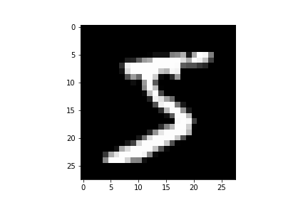
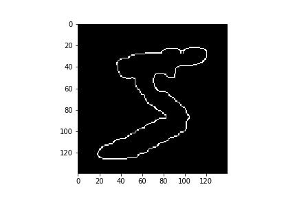
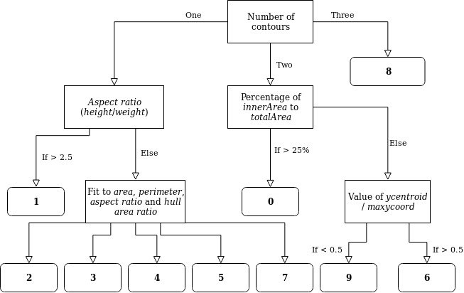

# Image classification
After learning about classic digital image processing procedures, like segmentation, filtering and image compression, at one of my courses at Uppsala university, I'm attempting a small test. The goal is to compare the accuracy and needed time span of two approaches for classification of images. The first approach is what I call the 'traditional' image processing approach, which involves a series of steps meant to lead to a representation and description of the image object, which can then be used to classify the object. The second approach is the modern deep learning method, which features an end-to-end process for image classification. The dataset which will be used is the MNIST handdrawn digits dataset, a classic dataset within image classification. The datset is added to this repository, but can also be found here:http://yann.lecun.com/exdb/mnist/

## Traditional image processing
The afore mentioned traditional image processing consists of several steps, like preprocessing and enhancement, segmentation, feature extraction etc. These steps are used in order to either answer a research question, or to represent the image/object in some different way. Since the images in the MNIST dataset only consist of 28 x 28 pixels, the first processing step was to resize the image and use the Bilinear Interpolation method. By using a global threshold, the background was removed from the object, after which the Canny method was employed to draw an edge around the object. Following this, converting the edge into a series of points representing the contour enables the retrieval of descriptors, such as the area and perimeter of the object. These descriptors can then be used for object classification. The image below features a decision tree which displays how this classification based on descripors is done. An alternative method for segmentation of objects is the distance transform followed by the watershed method. However, in opencv the watershed method seemed to have some issues with grayscale image, so I choose the above specified method for segmentation instead.

	

The Image_Processing_Demo.ipynb notebook displays the image processing pipeline and uses the training data to extract values for the parameters used for the digit classification. The Image_Processing_Classifier.ipynb uses the test data set and features the complete classification procedure. It also contains a random classifier.

## Deep Learning

The Deep Learning method uses multiple layers in a network which, by using weighted connections between the nodes of different layers, is able to extract higher level features from the input. This means that every consecutive layer is able to detect more detailed patterns in the input. The Deep_Learning_classifier.ipynb notebook features my Neural Network. It uses two hidden layer and the ReLu activation function. The code is heavily based on a youtube tutorial: https://www.youtube.com/watch?v=wQ8BIBpya2k

## Results
Classification of the images in the MNIST test data set of 10000 samples was done using the three methods mentioned above. The random classifier made 9052 errors, meaning it has an accuracy of under 10%. The tradional classifier took 17 seconds, but made 7182 errors, resulting in an accuracy of about 28%. Finally, the Deep Learning network took about 20 seconds to train, but managed to attain an accuracy of almost 97%.

Admittedly, both the traditional and deep learning methods I employed were fairly simple. However, this small test does explain the huge popularity of deep Neural Networks in image classification.
